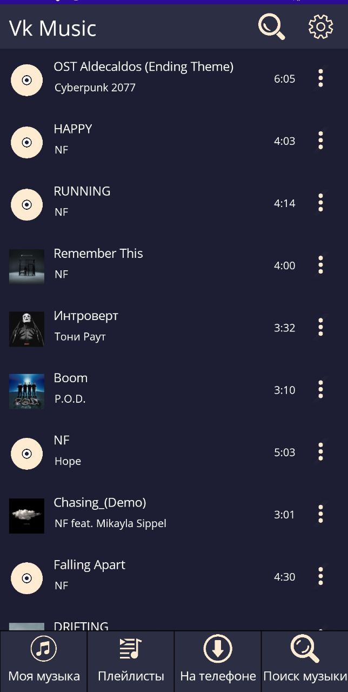
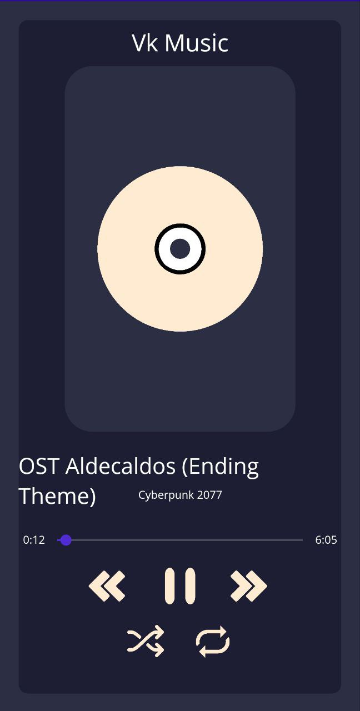
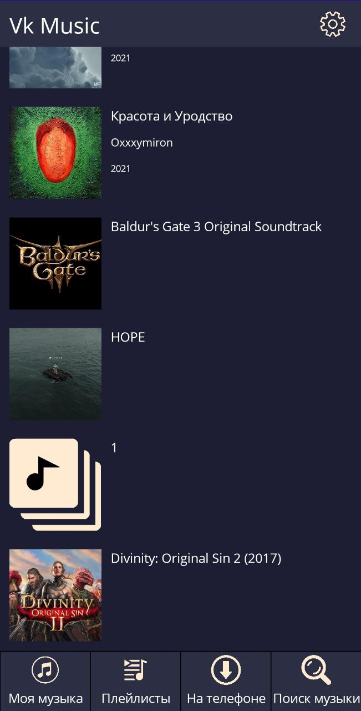
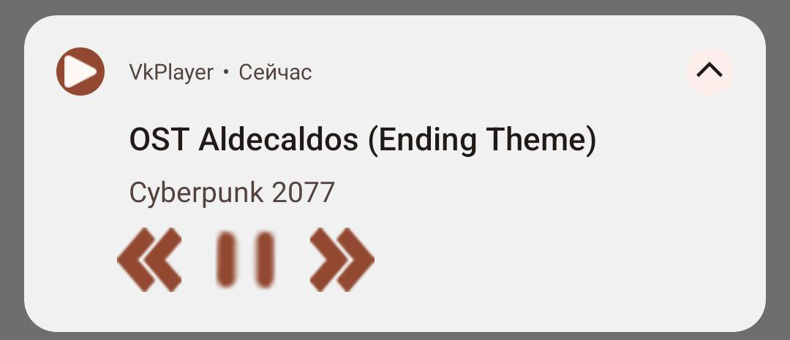

# VkMusic App
___
## Технологии

___
## Краткое описание проекта
Устав от правил ВК насчет музыки и того что стороние плееры тоже загибаются от рекламы, я решил сделать собственный для личного пользования
### Возможности
- Слушать музыку с ВК профиля   
- Скачивать её на телефон для оффлайн 
- Искать музыку по всем загруженным трекам в ВК
___
### Иллюстрация страницы со всеми треками с аккаунта ВК

### Страница с плеером

### Плейлисты

### Плеер в нотификациях
